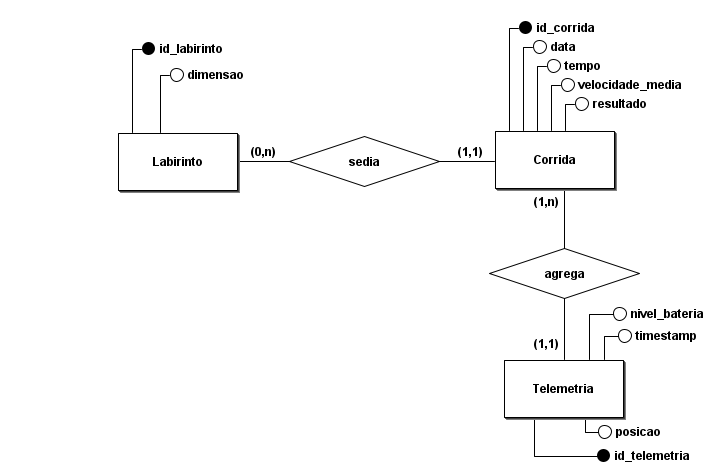

# Schema do Banco de Dados

O banco de dados do sistema de telemetria do Micromouse foi modelado para armazenar informações sobre:

- Labirintos disponíveis
- Corridas realizadas pelo robô
- Eventos de telemetria enviados durante a execução

Durante o desenvolvimento inicial do projeto será utilizado SQLite, por ser leve e simples para testes locais. Para a apresentação final e cenários com maior volume de dados, existe a possibilidade de migração para PostgreSQL, garantindo maior robustez e suporte a múltiplas conexões simultâneas.

A escolha definitiva entre banco relacional ou não-relacional poderá ser revisada futuramente conforme o volume e a estrutura dos dados coletados pelo sistema.

---

# Tecnologias Utilizadas

| Camada | Tecnologia |
|---|---|
| ORM | SQLAlchemy |
| Migrations | Alembic |
| Banco de Dados | SQLite / PostgreSQL |
| Backend | FastAPI |

---

# Modelo Entidade-Relacionamento

As principais entidades do sistema são:

- `Labirinto`
- `Corrida`
- `EventoTelemetria`

## Entidade: Labirinto

Representa os tipos de labirinto suportados pelo sistema.

Atributos:
- dimensão

---

## Entidade: Corrida

Representa uma execução realizada pelo Micromouse em um determinado labirinto.

Atributos:
- data
- tempo de conclusão
- velocidade média
- resultado

Cada corrida está associada a um único labirinto.

---

## Entidade: EventoTelemetria

Representa os dados enviados pelo robô durante a execução da corrida.

Atributos:
- posição X
- posição Y
- nível de bateria
- timestamp

Uma corrida agrega múltiplos registros de telemetria ao longo de sua execução.

---

# Estrutura do Banco

O schema é composto por 3 tabelas principais:

- `labirintos`
- `corridas`
- `eventos_telemetria`

---

# Tabela: labirintos

Armazena os tipos de labirinto suportados pelo sistema.

| Campo | Tipo | Descrição |
|---|---|---|
| id | Integer | Identificador único |
| dimensao | Enum | Dimensão do labirinto (`4x4`, `8x8`, `16x16`) |

## Exemplo

| id | dimensao |
|---|---|
| 1 | 4x4 |
| 2 | 8x8 |
| 3 | 16x16 |

---

# Tabela: corridas

Armazena informações sobre cada execução realizada pelo Micromouse.

| Campo | Tipo | Descrição |
|---|---|---|
| id | Integer | Identificador único |
| labirinto_id | Integer | FK para `labirintos.id` |
| data | DateTime | Data e hora da corrida |
| duracao | Float | Tempo total da corrida |
| velocidade_media | Float | Velocidade média do robô |
| resultado | Enum | Resultado da corrida |

## Valores possíveis para resultado

- `concluida`
- `falha`
- `em_andamento`

---

# Tabela: eventos_telemetria

Armazena os dados de telemetria enviados pelo robô durante a corrida.

| Campo | Tipo | Descrição |
|---|---|---|
| id | Integer | Identificador único |
| corrida_id | Integer | FK para `corridas.id` |
| timestamp | DateTime | Momento do evento |
| posicao_x | Integer | Coordenada X |
| posicao_y | Integer | Coordenada Y |
| nivel_bateria | Float | Percentual da bateria |

---


# Diagrama ER



---


# Dados de Teste

O seed adiciona:

- Labirintos 4x4, 8x8 e 16x16
- Corridas de exemplo
- Eventos de telemetria simulados

---

# Objetivo do Schema

O schema foi projetado para:

- Registrar execuções do Micromouse
- Armazenar telemetria em tempo real
- Permitir análise histórica de desempenho
- Suportar visualização futura no frontend web
- Facilitar integração com APIs FastAPI

---

# Estrutura de Arquivos

```text
src/backend/
│
├── app/
│   ├── database.py
│   └── models/
│       └── models.py
│
├── migrations/
|    ├── env.py
│    └── versions/
│       └── 001_initial_schema.py
│
├── seed.py
├── alembic.ini
└── micromouse.db
```

# Como Rodar

## Ativar a venv

Linux/macOS:
```bash
source venv/bin/activate
```

Windows (Git Bash):
```bash
source venv/Scripts/activate
```

## Instalar dependências
```bash
pip install -r requirements.txt
```

## Aplicar migrations
```bash
PYTHONPATH=. alembic upgrade head
```

## Popular com dados de teste
```bash
PYTHONPATH=. python seed.py
```
ou
```bash
python seed.py
```
